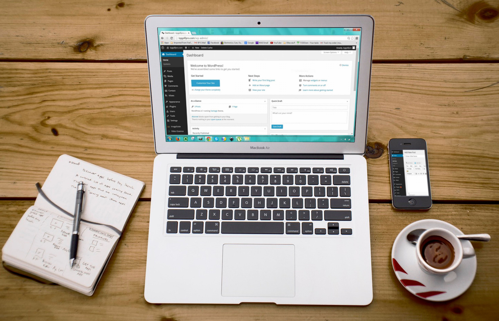

<p align="center">
  
</p>

# <p align="center">Glad Blog </a></p>

Un simple blog qui fait un CRUD mais écrit en php pure pour apprendre les fondamentaux.

### Buts

le but est d'apprendre deux types de compétence:
- Une architecture MVC (Model - View - Controller) et la POO en php.
- Un modèle de domaine riche (règles métier dans les Entities, Managers = persistance).
- Utilisation d'un système de route avec les outils de php sans framework.
- Usage de Docker pour démarrer l'app avec docker-compose en définissant soi-même la configuration.

Les [design patterns](https://refactoring.guru/design-patterns) mis en œuvre :

- **[Factory Method](https://refactoring.guru/design-patterns/factory-method)** : `PDOFactory` encapsule la création des connexions PDO (`getMySqlPDO()`, etc.) derrière l’interface `Database`.
- **[Template Method](https://refactoring.guru/design-patterns/template-method)** : les classes abstraites `AbstractController`, `BaseManager` et `BaseEntity` fixent le squelette (dispatch, connexion PDO, hydratation) ; les sous-classes n’implémentent que le détail.

## Technologie

Langages: PHP 8.1/JavaScript/HTML/CSS<br/>
Base de donnée: SQL/MySQL<br/>
Serveur: Apache

## Installation

1. Clonez le dépôt et placez-vous sur la branche `main` :

Note : vous pouvez aussi fork le dépôt ou utiliser le template.

```bash
git clone https://github.com/ExploryKod/glad_blog_MVC.git
cd glad_blog_MVC
```

2. Lancez les conteneurs :

```bash
docker compose up -d --build
```

3. Ouvrez l’application :

| Service | URL |
|---------|-----|
| Blog | http://localhost:1300 |
| Adminer | http://localhost:1301 |

Base de donnée (adminer) : 
- Serveur : database
- User : root
- Password : password
- Database : glad_blog

4. Se connecter avec l'utilisateur de démo
- pseudo : `amaury` / mot de passe : `password`